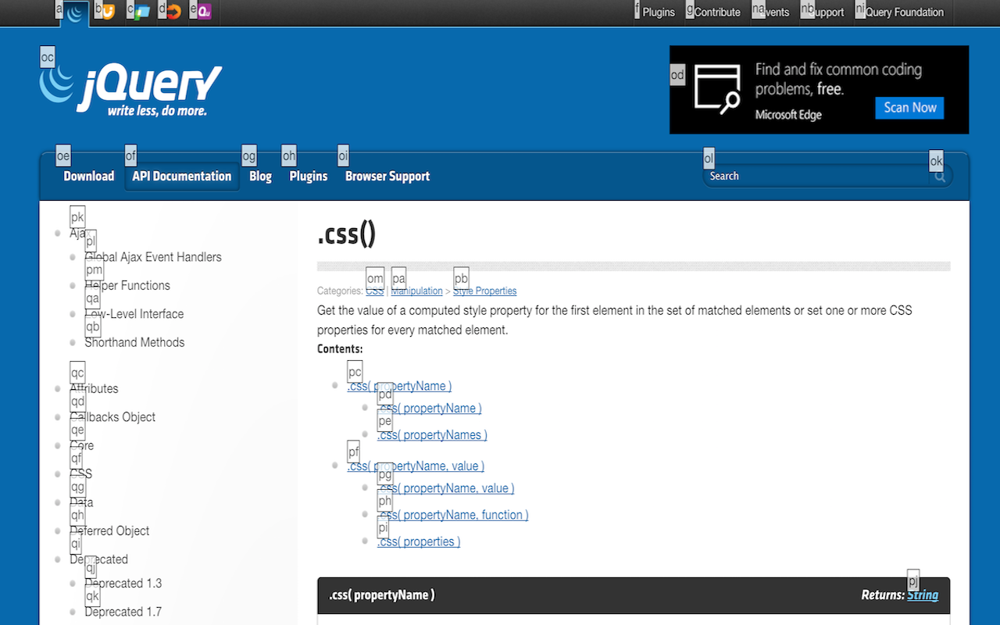

#Synopsis

This project, currently titled SignPost, is a Chrome extension that after the extension is triggered, will assign a shortcut to every visible link on a webpage, show the user those shortcuts, and "click" the selected link once the user has entered that keyboard sequence. This allows for faster, mouse-free clicking clicking behavior.

#Usage

Simply trigger the extension with the initial shortcut (default is cmd-k), and the screen will display an overlaid tooltip for every clickable link, button, or input form on the page. Enter the key sequence in a given tooltip to click or activate that element.

If you make a mistake, hit Esc or click the mouse anywhere to exit the extension.

#Motivation

Anyone who has ever used [the alt-based shortcuts in Microsoft Office](https://youtu.be/KNYk7AEMEIQ) (maybe 2010+ editions?) enjoyed the ability to use shortcuts without knowing them ahead of time. This project applies a similar concept to the web so that you can click around without your mouse.

#Disclaimer/Contributing

As this is a free side project, it is still lacking a number of features that may someday be added. Not all things that we have come to think of as buttons, links, etc. will be selected by SignPost, which only looks at `a`, `input`, and `button` tags. Many other items on the web are "clickable", but in more subtle ways. The service may not place popups correctly in all cases or even work on some sites at all. Feel free to make pull requests or submit issues for things for us to consider. We hope that even with its flaws, Breadcrumbs improves your ability to shortcut the web.